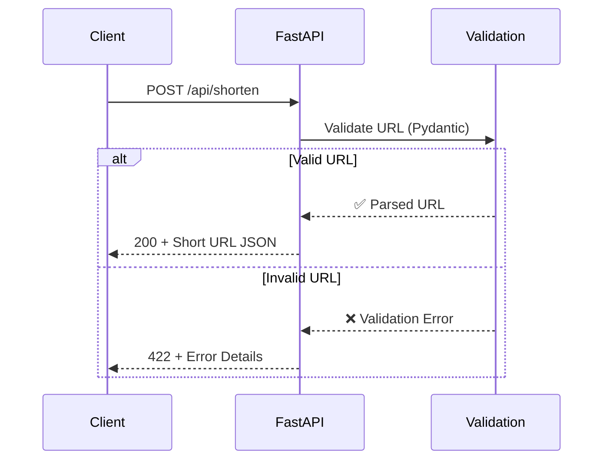

# 📡 API Design

## Overview

The TinyURL API follows **RESTful** conventions with JSON payloads. FastAPI provides automatic **OpenAPI/Swagger** documentation at `/docs`.

## Authentication

Protected endpoints require a `Bearer` token in the `Authorization` header:

```
Authorization: Bearer <keycloak-jwt-token>
```

| Endpoint | Auth |
|---|---|
| `POST /api/shorten` | ✅ Required |
| `GET /api/urls/recent` | ⚡ Optional (filters by user) |
| `GET /{short_code}` | ❌ Public |
| `GET /api/urls/{code}/stats` | ❌ Public |

## Endpoints

### Create Short URL

```
POST /api/shorten
```

🔒 **Requires authentication.**

Accepts a long URL and returns a shortened version linked to the authenticated user.

=== "Request"

    ```
    Authorization: Bearer <token>
    Content-Type: application/json
    ```

    ```json
    {
      "url": "https://www.example.com/very/long/path?with=params&and=more"
    }
    ```

=== "Response (201)"

    ```json
    {
      "short_code": "kX9mBzQ",
      "short_url": "http://localhost:8000/kX9mBzQ",
      "original_url": "https://www.example.com/very/long/path?with=params&and=more",
      "created_at": "2026-03-15T12:00:00Z"
    }
    ```

=== "Error (422)"

    ```json
    {
      "detail": [
        {
          "type": "url_parsing",
          "msg": "Input should be a valid URL"
        }
      ]
    }
    ```

---

### Redirect to Original URL

```
GET /{short_code}
```

Redirects to the original URL using a **307 Temporary Redirect**.

!!! info "Why 307 instead of 301?"
    - **301 (Permanent):** Browser caches the redirect forever. We can't track clicks or change the destination.
    - **307 (Temporary):** Browser asks our server every time. We can track clicks and update URLs if needed.

---

### Get URL Statistics

```
GET /api/urls/{short_code}/stats
```

Returns click count and metadata for a shortened URL.

=== "Response (200)"

    ```json
    {
      "short_code": "kX9mBzQ",
      "short_url": "http://localhost:8000/kX9mBzQ",
      "original_url": "https://www.example.com/very/long/path",
      "clicks": 42,
      "created_at": "2026-03-15T12:00:00Z",
      "is_active": true
    }
    ```

=== "Error (404)"

    ```json
    {
      "detail": "Short URL not found"
    }
    ```

---

### List Recent URLs

```
GET /api/urls/recent
```

⚡ **Optional authentication.** When authenticated, returns the user's URLs. Otherwise returns global recent URLs.

=== "Response (200)"

    ```json
    [
      {
        "short_code": "kX9mBzQ",
        "short_url": "http://localhost:8000/kX9mBzQ",
        "original_url": "https://www.example.com/...",
        "clicks": 42,
        "created_at": "2026-03-15T12:00:00Z"
      }
    ]
    ```

## Request/Response Flow



## Design Decisions

### URL Validation with Pydantic

```python
from pydantic import BaseModel, HttpUrl

class ShortenRequest(BaseModel):
    url: HttpUrl  # Validates URL format automatically
```

Pydantic's `HttpUrl` type ensures:

- URL has a valid scheme (http/https)
- Domain is present and valid
- Automatic normalization

### CORS Configuration

```python
app.add_middleware(
    CORSMiddleware,
    allow_origins=["http://localhost:5173"],  # React dev server
    allow_methods=["*"],
    allow_headers=["*"],
)
```

!!! warning "Production CORS"
    In production, replace `localhost:5173` with your actual frontend domain. Never use `allow_origins=["*"]` in production.

### Swagger UI

FastAPI automatically generates interactive API docs at `http://localhost:8000/docs`:

- **Try it out** — test endpoints directly from the browser
- **Schema** — see all request/response models
- **Validation** — see which fields are required/optional
