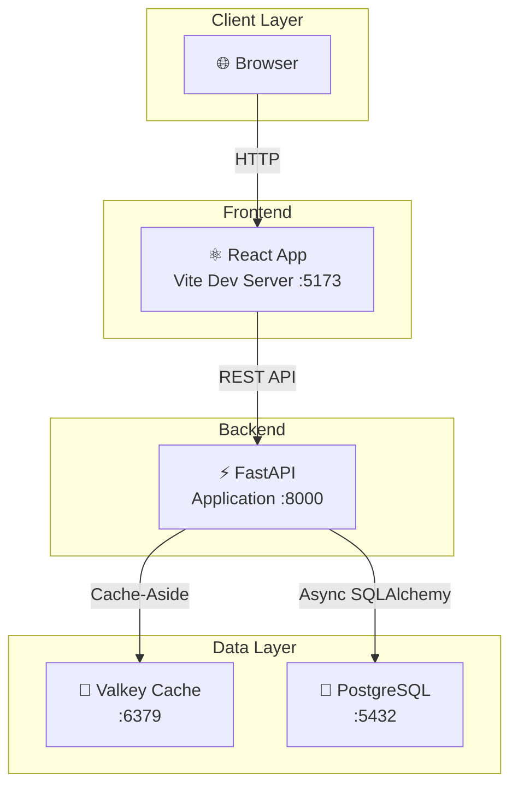
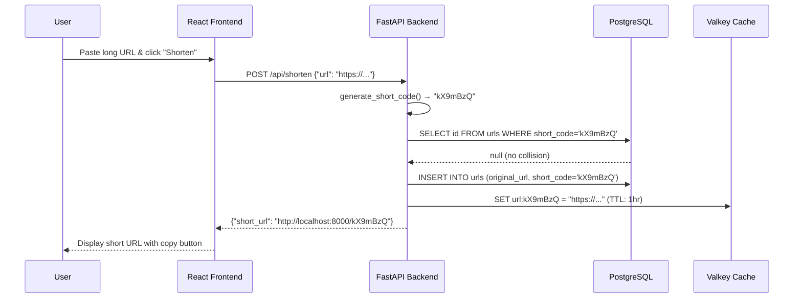
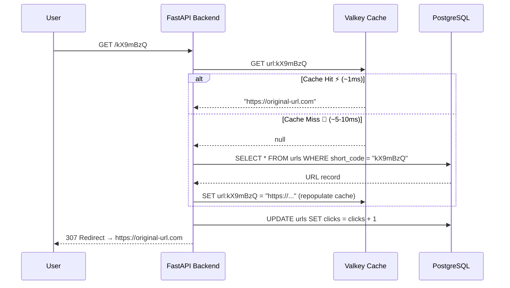
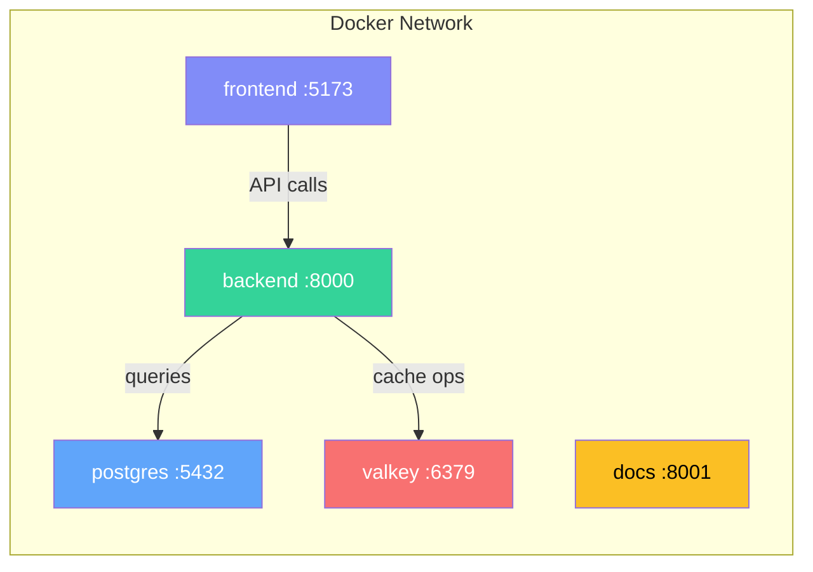

# 🏗️ System Architecture

## High-Level Architecture

The system follows a **3-tier architecture** with a caching layer:

## Request Flow

### Write Path (Create Short URL)

When a user shortens a URL, the request flows through the system like this:

### Read Path (Redirect)

When someone visits a short URL, the system uses the **cache-aside pattern**:

## Component Responsibilities

| Component | Responsibility | Why This Choice? |
|---|---|---|
| **React + Vite** | UI for URL shortening and history | Fast HMR, modern DX, simple SPA |
| **FastAPI** | REST API, business logic, routing | Async-native, automatic OpenAPI docs, fast |
| **PostgreSQL** | Persistent URL storage, click tracking | ACID compliance, reliable, great indexing |
| **Valkey** | Cache hot URLs, reduce DB load | Redis-compatible, sub-millisecond lookups |
| **Docker Compose** | Orchestrate all services | One command to start everything |

## Communication Patterns

### Frontend ↔ Backend
- **Protocol:** HTTP/REST
- **Format:** JSON
- **CORS:** Enabled for `localhost:5173`

### Backend ↔ Cache (Valkey)
- **Pattern:** Cache-Aside (Lazy Loading)
- **Protocol:** Redis protocol (RESP)
- **Connection:** Async via `valkey-py`
- **TTL:** 1 hour per entry

### Backend ↔ Database (PostgreSQL)
- **ORM:** SQLAlchemy 2.0 (async)
- **Driver:** asyncpg (fastest PostgreSQL driver for Python)
- **Connection Pool:** Managed by SQLAlchemy engine

## Docker Compose Network

All services communicate over a shared Docker bridge network:

!!! info "Service Dependencies"
    The backend waits for PostgreSQL and Valkey to be healthy before starting, ensuring database tables are created before serving requests.
