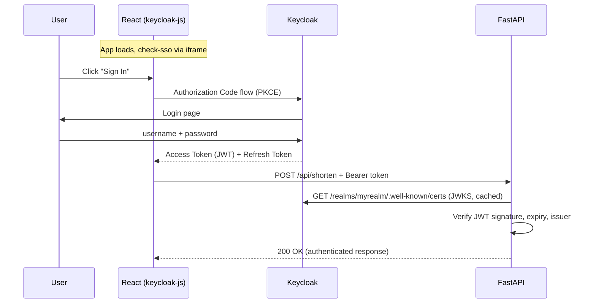

# 🔐 Authentication

## Overview

TinyURL uses **Keycloak** as an identity provider with **OpenID Connect (OIDC)** for user authentication. The frontend uses `keycloak-js` for login flows, and the backend validates JWT tokens on protected endpoints.

## Architecture



## Components

### Frontend (keycloak-js)

The React app initializes Keycloak with `check-sso` mode:

```javascript
// src/keycloak.js
const keycloak = new Keycloak({
  url: 'http://localhost:8080',
  realm: 'myrealm',
  clientId: 'react-client',
});
```

- **check-sso:** Silently checks if user is already logged in (via iframe)
- **Token refresh:** Automatically refreshes tokens before they expire
- **Public client:** No client secret needed (browser app)

### Backend (FastAPI + python-jose)

JWT validation as a FastAPI dependency:

```python
# app/auth.py
async def get_current_user(token) -> dict:
    # 1. Fetch Keycloak JWKS (cached)
    # 2. Verify JWT signature (RS256)
    # 3. Check expiry, issuer
    # 4. Return user claims (sub, email, username)
```

Two dependency modes:
- `get_current_user` — **required** auth, returns 401 if no/invalid token
- `get_optional_user` — **optional** auth, returns `None` if no token

### Keycloak Configuration

The realm is configured via `auth/realm.json`:

| Setting | Value |
|---|---|
| Realm | `myrealm` |
| Client ID | `react-client` |
| Client Type | Public (no secret) |
| Flows | Authorization Code, Implicit |
| Registration | Enabled |

## Protected vs. Public Endpoints

| Endpoint | Auth Required? | Behavior |
|---|---|---|
| `POST /api/shorten` | ✅ Required | 401 if not authenticated |
| `GET /api/urls/recent` | ⚡ Optional | Shows user's URLs when authenticated, global otherwise |
| `GET /{short_code}` | ❌ Public | Anyone can follow short links |
| `GET /api/urls/{code}/stats` | ❌ Public | Click stats are public |

## User Auto-Creation

When a user authenticates for the first time, the backend automatically creates a `User` record from the JWT claims:

```python
async def _get_or_create_user(db, user_info):
    # user_info["sub"] → Keycloak user UUID → users.id
    # user_info["email"] → users.email
    # user_info["preferred_username"] → users.username
```

This links shortened URLs to their creator via `urls.user_id`.

## Test Credentials

| Field | Value |
|---|---|
| Username | `testuser` |
| Password | `password` |
| Email | `test@example.com` |

!!! warning "Development Only"
    These credentials are for local development. In production, use Keycloak's admin console to manage users, enable 2FA, and configure proper password policies.
