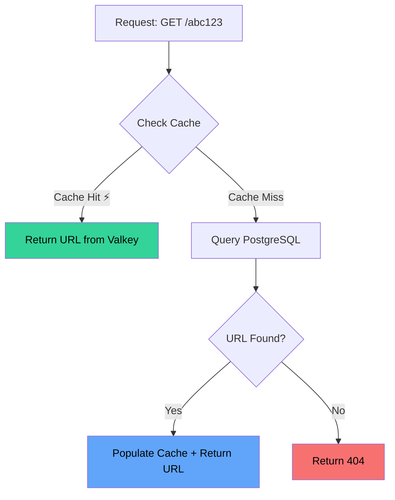

# ⚡ Caching Strategy

## Why Cache?

URL shorteners are **read-heavy** systems. For every URL created, it might be accessed hundreds or thousands of times. Without caching, every redirect hits the database:

| Metric | Without Cache | With Cache |
|---|---|---|
| Redirect latency | 5-10ms (DB query) | **~1ms** (cache hit) |
| DB load at 10K req/s | 10K queries/sec | ~1K queries/sec (90% cache hit) |
| Cost | High DB scaling costs | Cheap in-memory cache |

## Cache-Aside Pattern (Lazy Loading)

We use the **cache-aside** pattern, where the application manages the cache:



### Implementation

```python
async def resolve_short_url(db, short_code):
    # Step 1: Check cache (fast path, ~1ms)
    cached_url = await cache.get_url(short_code)
    if cached_url:
        await _increment_clicks(db, short_code)
        return cached_url
    
    # Step 2: Cache miss — query DB (slow path, ~5-10ms)
    url_record = await db.execute(
        select(URL).where(URL.short_code == short_code)
    )
    
    if not url_record:
        return None
    
    # Step 3: Populate cache for next request (self-healing)
    await cache.set_url(short_code, url_record.original_url)
    
    return url_record.original_url
```

## Why Valkey?

[Valkey](https://valkey.io/) is an open-source, Redis-compatible in-memory data store:

| Feature | Benefit |
|---|---|
| **Redis-compatible** | Same protocol, same client libraries |
| **In-memory** | Sub-millisecond read/write |
| **Open source** | Community-driven, no license concerns |
| **Persistence** | Optional RDB/AOF persistence |
| **Data structures** | Strings, hashes, sorted sets, etc. |

## Cache Key Design

```
url:{short_code} → original_url
```

**Examples:**

```
url:kX9mBzQ → "https://www.google.com/search?q=system+design"
url:T2pLn8w → "https://github.com/some/very/long/path"
```

!!! tip "Key design principles"
    - **Namespaced**: `url:` prefix prevents collisions with other cache uses
    - **Simple**: Just stores the URL string, no JSON serialization overhead
    - **Deterministic**: Same short code always maps to the same key

## TTL Strategy

**TTL (Time To Live) = 1 hour (3600 seconds)**

```python
CACHE_TTL = 3600  # seconds

async def set_url(self, short_code, original_url):
    await self.client.set(
        f"url:{short_code}", original_url, ex=CACHE_TTL
    )
```

### Why 1 hour?

| TTL | Pros | Cons |
|---|---|---|
| Short (5 min) | Fresh data, less memory | More DB queries |
| **1 hour** ✅ | Good balance | Acceptable staleness window |
| Long (24 hours) | Fewer DB queries | More memory, stale data |
| No TTL | Maximum cache hit rate | Memory leak risk |

## Cache Patterns Compared

| Pattern | How It Works | Our Choice? |
|---|---|---|
| **Cache-Aside** ✅ | App checks cache → DB fallback → populate cache | Yes |
| Read-Through | Cache itself fetches from DB on miss | No (more complex) |
| Write-Through | Write to cache and DB simultaneously | No (adds write latency) |
| Write-Behind | Write to cache, async write to DB | No (risk of data loss) |

### Why Cache-Aside?

1. **Simplicity** — The application controls when to read/write cache
2. **Resilience** — If cache goes down, system still works (just slower)
3. **Lazy loading** — Only hot data is cached, saving memory
4. **Perfect for read-heavy** — URL shorteners are 100:1 read:write ratio

## Fault Tolerance

The cache client is designed to be **non-critical**:

```python
async def get_url(self, short_code):
    try:
        cached = await self.client.get(f"url:{short_code}")
        return cached
    except Exception as e:
        logger.warning(f"Cache read error: {e}")
        return None  # Gracefully fall back to DB
```

!!! warning "Cache is NOT the source of truth"
    If Valkey goes down, the system degrades gracefully — all requests go to PostgreSQL. Performance drops but the service stays available.

## Cache Invalidation

> "There are only two hard things in Computer Science: cache invalidation and naming things."
> — Phil Karlton

For URL shorteners, cache invalidation is straightforward:

| Event | Cache Action |
|---|---|
| URL created | `SET url:{code} = url` (pre-warm) |
| URL deactivated | `DELETE url:{code}` (invalidate) |
| URL updated | `DELETE url:{code}` (invalidate, will re-cache on next read) |
| TTL expires | Automatic eviction (self-healing) |

Since URLs rarely change after creation, our TTL-based approach handles 99% of cases.
