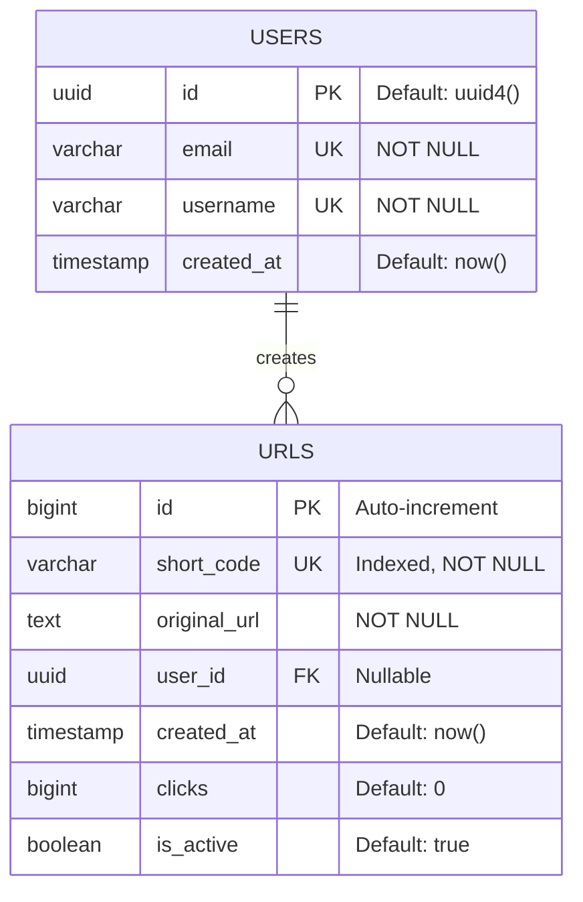
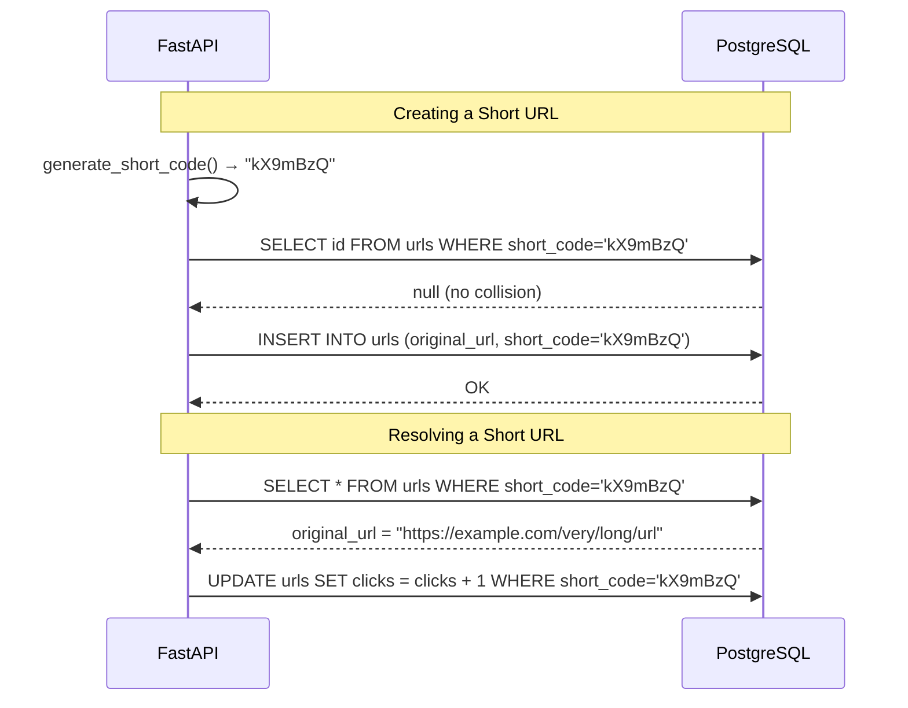

# 🗃️ Database Design

## Schema Overview



## Why These Design Choices?

### Random Alphanumeric Short Codes

We generate **cryptographically random** codes using `a-zA-Z0-9` (62 characters):

```
secrets.choice("abcdefghijklmnopqrstuvwxyzABCDEFGHIJKLMNOPQRSTUVWXYZ0123456789")
→ "kX9mBzQ"
```

| Approach | Pros | Cons |
|---|---|---|
| **Random alphanumeric** ✅ | Unpredictable, no enumeration | Collision handling needed |
| Base62 from auto-increment ID | No collisions | Sequential — easily enumerable ⚠️ |
| MD5/SHA-256 truncation | Deterministic | Collision handling + longer codes |
| UUID | Universally unique | Too long for short URLs |
| Pre-generated pool | Fast at runtime | Complex pool management |

!!! warning "Why NOT Base62 from sequential IDs?"
    If short codes are `0000001`, `0000002`, `0000003`... an attacker can trivially enumerate every URL in your system. Random codes like `kX9mBzQ` prevent this.

### Character Set

```
a-z  → 26 characters
A-Z  → 26 characters
0-9  → 10 characters
Total: 62 characters
```

**Capacity by short code length:**

| Length | Unique URLs | Scale |
|---|---|---|
| 6 | 56.8 billion | ~56B URLs |
| **7** | **3.5 trillion** | **Our default** |
| 8 | 218 trillion | Enterprise scale |

### The Generation Algorithm

```python
import secrets
import string

CHARSET = string.ascii_lowercase + string.ascii_uppercase + string.digits

def generate_short_code(length: int = 7) -> str:
    """Generate a cryptographically random alphanumeric short code."""
    return "".join(secrets.choice(CHARSET) for _ in range(length))
```

!!! example "Example Codes"
    Each call produces a different random code:

    - `kX9mBzQ`
    - `T2pLn8w`
    - `Hy5RcFv`

### Collision Handling

With 62^7 = ~3.5 trillion possible codes, collisions are extremely rare, but we handle them:

```python
for attempt in range(MAX_RETRIES):
    short_code = generate_short_code()
    if not await _code_exists(db, short_code):
        break  # No collision, use this code
    logger.warning(f"Collision on attempt {attempt + 1}")
```

The probability of collision with `n` existing URLs: `P ≈ n / 62^7`. Even with 1 billion URLs, the chance is only ~0.00003%.

## Indexing Strategy

### Primary Index
- `urls.id` — Primary key, auto-increment (internal use only, not exposed)

### Unique Index
- `urls.short_code` — For fast lookups during redirect (`O(1)` via B-tree)

This is the most critical index because **every redirect** queries by `short_code`:

```sql
-- This query runs on EVERY redirect request
SELECT * FROM urls WHERE short_code = '008M0kX' AND is_active = true;
```

Without the index: **full table scan** (`O(n)`) — will destroy performance at scale.  
With the index: **B-tree lookup** (`O(log n)`) — consistent sub-millisecond performance.

### Future Indexes

When scaling, consider adding:

```sql
-- For user's URL dashboard
CREATE INDEX idx_urls_user_id ON urls(user_id) WHERE user_id IS NOT NULL;

-- For analytics queries
CREATE INDEX idx_urls_created_at ON urls(created_at DESC);

-- For cleanup jobs
CREATE INDEX idx_urls_is_active ON urls(is_active) WHERE is_active = false;
```

## Nullable user_id — Future-Proofing

The `user_id` column is **nullable by design**:

```python
user_id: Mapped[uuid.UUID | None] = mapped_column(
    UUID(as_uuid=True), ForeignKey("users.id"), nullable=True
)
```

!!! tip "Why nullable?"
    - **Now:** URLs can be created anonymously (no login required)
    - **Later:** When you add authentication, just populate `user_id` on new URLs
    - **No migration needed** — the schema is ready for auth from day one

## Data Flow Through the Schema



