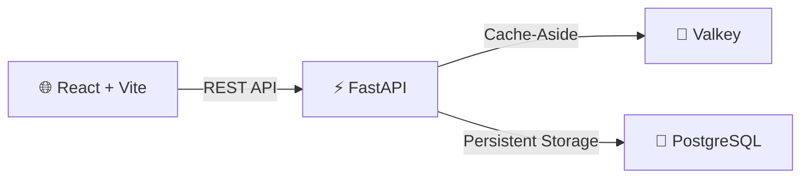

# 🔗 TinyURL — System Design Learning Project

Welcome to the **TinyURL System Design** documentation! This project teaches core system design concepts by building a fully functional URL shortening service.

## What You'll Learn

| Concept | Where |
|---|---|
| **System Architecture** | How frontend, backend, cache, and database work together |
| **Database Design** | Schema design, indexing, and random code generation |
| **Caching** | Cache-aside pattern with Valkey (Redis-compatible) |
| **API Design** | RESTful API design with FastAPI |
| **Scaling** | Horizontal scaling, sharding, and load balancing |
| **Trade-offs** | Real-world engineering decisions and their impacts |

## Tech Stack



| Layer | Technology | Purpose |
|---|---|---|
| Frontend | React + Vite | Single-page UI for shortening URLs |
| Backend | FastAPI (Python) | REST API with async support |
| Cache | Valkey | Redis-compatible in-memory cache |
| Database | PostgreSQL | Persistent URL storage |
| Docs | MkDocs Material | This documentation site |

## Quick Start

```bash
# Clone and start all services
git clone <repo-url>
cd tiny-url
docker compose up --build -d

# Access the services
# Frontend:  http://localhost:5173
# Backend:   http://localhost:8000/docs  (Swagger UI)
# Docs:      http://localhost:8001
```

## How It Works (30-Second Overview)

1. **User pastes a URL** into the React frontend
2. **Frontend calls** `POST /api/shorten` on the FastAPI backend
3. **Backend generates** a cryptographically random alphanumeric code (e.g., `kX9mBzQ`)
4. **Code is checked** for uniqueness against the database (collision → retry)
5. **Record is inserted** into PostgreSQL and **cached** in Valkey
6. **When someone visits** the short URL, backend checks Valkey first (cache hit = ~1ms), then falls back to PostgreSQL (cache miss = ~5-10ms)
7. **Click count** is incremented and the user is redirected

!!! tip "Why is this a great system design exercise?"
    URL shortening touches on nearly every system design concept: hashing, caching, database indexing, horizontal scaling, rate limiting, and API design — all in a simple, easy-to-understand domain.
