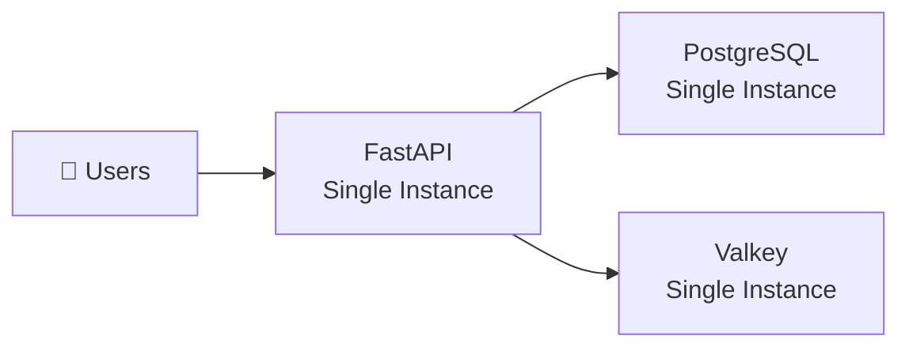
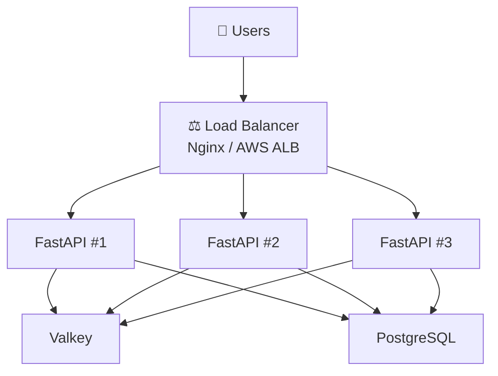
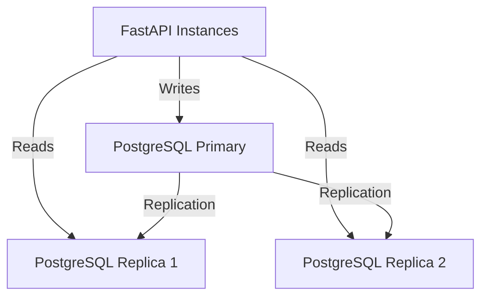
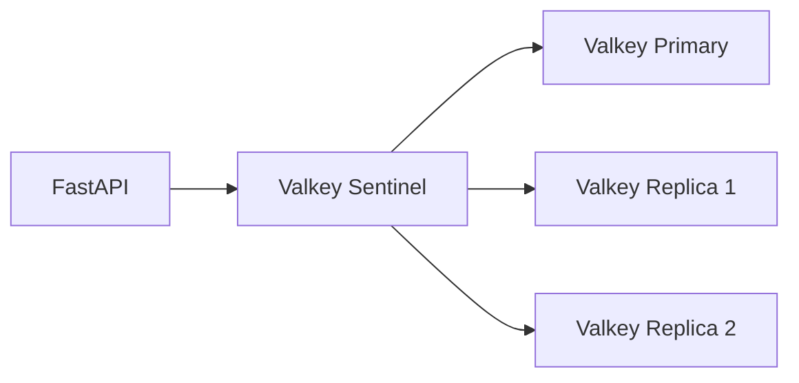
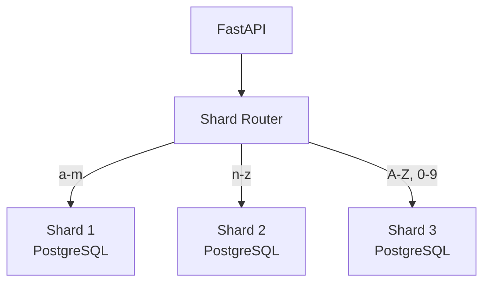
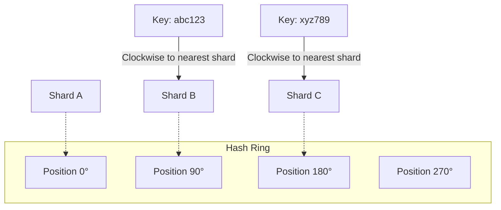
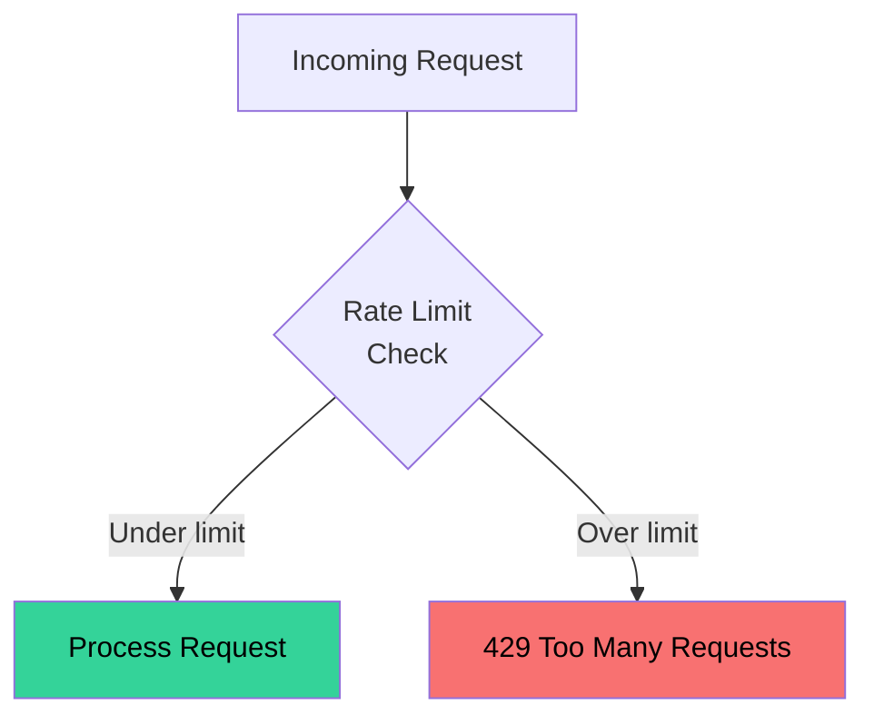

# 📈 Scaling

## Current Architecture (Single Server)

Our current setup runs on a single machine:

**Capacity:** ~1,000-5,000 requests/second on modern hardware.

But what happens when you go viral and need to handle **100K+ requests/second**?

## Scaling Strategy

### Step 1: Horizontal API Scaling

Add a **load balancer** in front of multiple FastAPI instances:

!!! tip "Why this works"
    Our FastAPI instances are **stateless** — they don't store any session data. Any instance can handle any request, making horizontal scaling straightforward.

### Step 2: Read Replicas

Database reads (redirects) far outnumber writes (URL creation). Add **read replicas**:

| Operation | Database | Ratio |
|---|---|---|
| `POST /api/shorten` | Primary | ~1% |
| `GET /{short_code}` | Replica | ~99% |

### Step 3: Cache Clustering

Scale Valkey with a **cluster** or **replica set**:

### Step 4: Database Sharding

At massive scale (billions of URLs), shard by **short_code**:

**Sharding strategies:**

| Strategy | How | Pros | Cons |
|---|---|---|---|
| Range-based | a-m → Shard 1 | Simple | Uneven distribution |
| Hash-based | `hash(code) % N` | Even distribution | Hard to add shards |
| **Consistent Hashing** | Hash ring | Even + easy rebalancing | More complex |

## Consistent Hashing

The gold standard for distributed systems:

**Why consistent hashing?**

- Adding/removing a shard only moves **K/N** keys (K = total keys, N = shards)
- Compare with hash-based: adding a shard moves **~all** keys
- Used by: DynamoDB, Cassandra, Discord, and most CDNs

## Rate Limiting

Prevent abuse with rate limiting:

**Common algorithms:**

| Algorithm | Description | Use Case |
|---|---|---|
| Fixed Window | Count requests per time window | Simple, some edge cases |
| Sliding Window | Rolling count over time | More accurate |
| Token Bucket | Refill tokens at fixed rate | Allow bursts |
| Leaky Bucket | Process at fixed rate | Smooth traffic |

## Scaling Checklist

| Scale | Users | Strategy |
|---|---|---|
| **Hobby** | < 1K/day | Single server (current setup) |
| **Startup** | < 100K/day | Horizontal API + Valkey |
| **Growth** | < 1M/day | + Read replicas + CDN |
| **Scale** | < 100M/day | + Sharding + Rate limiting |
| **Massive** | 1B+/day | Multi-region + Consistent hashing |

## Additional Considerations

### CDN for Redirects
For global users, put a CDN (CloudFlare, CloudFront) in front to cache redirects at the edge.

### Analytics Pipeline
At scale, move click tracking to an **async pipeline** (Kafka → analytics DB) to avoid slowing down redirects.

### URL Expiration
Add a background job to clean up expired URLs and free up short codes for reuse.
